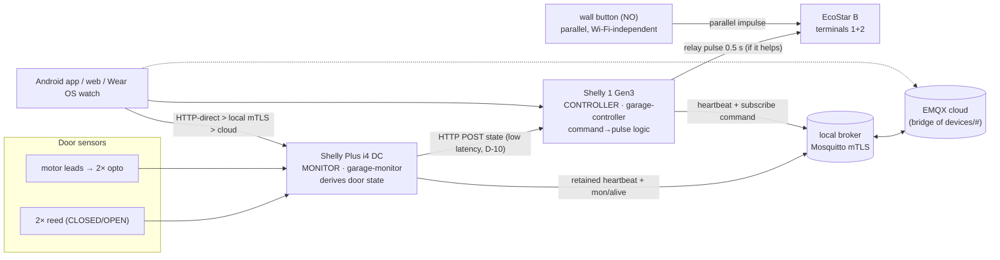

# Architecture overview

One-page map of the system. Depth lives in [`docs/spec/`](spec/INDEX.md); this links rather than
duplicates. Authoritative wiring/BOM is [`docs/initial-research/hardware-spec.md`](initial-research/hardware-spec.md).

## What it is

Remote + automatic control of a **Hörmann EcoStar B** garage door using **two Shelly devices**, fully
galvanically isolated from the opener. Two design pillars:

- **Safety-first** — the physical wall button and RF remotes operate the door with **zero dependence on
  Wi-Fi/MQTT/the script** (the button is wired in parallel with the relay across the EcoStar impulse
  terminals). Smart control is strictly additive.
- **Two devices, two roles** — the i4 *monitors*, the S1 *controls* (spec [01](spec/01-architecture.md)).

## Flows

- **State (up):** i4 reads 4 dry contacts → derives one of `CLOSED/OPEN/OPENING/CLOSING/STOPPED_OPENING/
  STOPPED_CLOSING/UNKNOWN` (spec [02](spec/02-state-machine.md)) → (a) HTTP-POSTs to S1 for low latency
  (fire-and-forget, never blocks — D-10), and (b) publishes a **retained** heartbeat to MQTT for any
  subscriber. Never gives a false position: NC reeds + a fail-safe derivation.
- **Commands (down):** app/web → `devices/garage-controller/command` (MQTT, non-retained) or S1's local
  HTTP → S1 maps `(command, current door state)` to a pulse plan: suppress when already there/going,
  1 pulse from a matching end/stop, **2 pulses (stop, then reverse)** to flip a moving door (the EcoStar
  impulse model, D-09/D-19). Relay = 0.5 s momentary across terminals 1+2.

## Transports & identities

- **Three client paths, in preference order** (NEW-PROJECT-GUIDE §5): **HTTP-direct** (same Wi-Fi, the hard
  requirement — works with the broker down) > **local broker** (mTLS) > **cloud** (WSS, user/pass).
- **MQTT** (spec [03](spec/03-mqtt-and-monitoring.md), [11](spec/11-broker-provisioning.md)): per-device
  retained `devices/<id>/heartbeat` (app status) **and** non-retained `mon/<id>/alive` (infra liveness —
  the monitor watches `alive`, never the retained heartbeat). Devices are mTLS clients
  (`garage-monitor`, `garage-controller`); the app is a per-app identity (`garage-app`).
- **Resilience** (spec [13](spec/13-device-resilience.md)): a connectivity watchdog reboots a device that's
  lost Wi-Fi/broker too long. Devices are stateless across reboot (monitor re-derives; controller boots
  relay-off), so boot is always safe — no resume gate.

## Components / repo layout

| Where | What |
|---|---|
| `device/monitor.js`, `controller.js` (+`.min.js`) | the two mJS scripts (deploy the minified build) |
| `device/test/` | Node mock-harness unit tests (60) |
| `device/test-rig/` | Pico MicroPython rig: `main.py` (host-driven inputs) + `door_sim.py` (autonomous "virtual EcoStar"), spec [12](spec/12-test-rig-and-wiring.md) |
| `app/` | Android app (Kotlin/Compose, Paho) — `no.leiflan.garage` |
| `wear/` | Wear OS companion (Kotlin/Compose) — same `applicationId`; rides the phone over the Data Layer (spec [17](spec/17-wear-os-exploration.md)); shared pure logic guarded by `check-wear-sync.sh` |
| `web/` | cloud-WSS control page |
| `scripts/` | build/deploy/observe/test tooling (`*-device.sh`, `test-web.sh`, `pico.sh`, `i4-watch.sh`, `i4-scenario.sh`, `mqtt-{sub,pub}.sh`, `soak.sh`, `rssi-watch.sh`, `win-build.sh`, `check-wear-sync.sh`) |
| `docs/spec/` | numbered design docs + `INDEX.md`; decisions/open-Qs in [08](spec/08-decisions-and-open-questions.md); plan in [09](spec/09-phase-plan.md) |
| `docs/testing/` | REGRESSION, AI-TEST-GUIDE, HW-VALIDATION |
| `private/` (gitignored) | real device certs + network inventory + the lessons guide; app creds live in Bitwarden |

## Status

Device tier (i4 monitor, S1 controller) built + hardware-verified; clients built and bench-validated —
app + Wear OS watch functionally tested on-device across all three transports incl. background drive
(HW-VALIDATION 2026-06-12); web tested; watchdog validated; CI/CD green. Remaining: the real garage
install (wire-up + commissioning — Q-02/Q-03/RSSI) and going public. See [09-phase-plan.md](spec/09-phase-plan.md).
