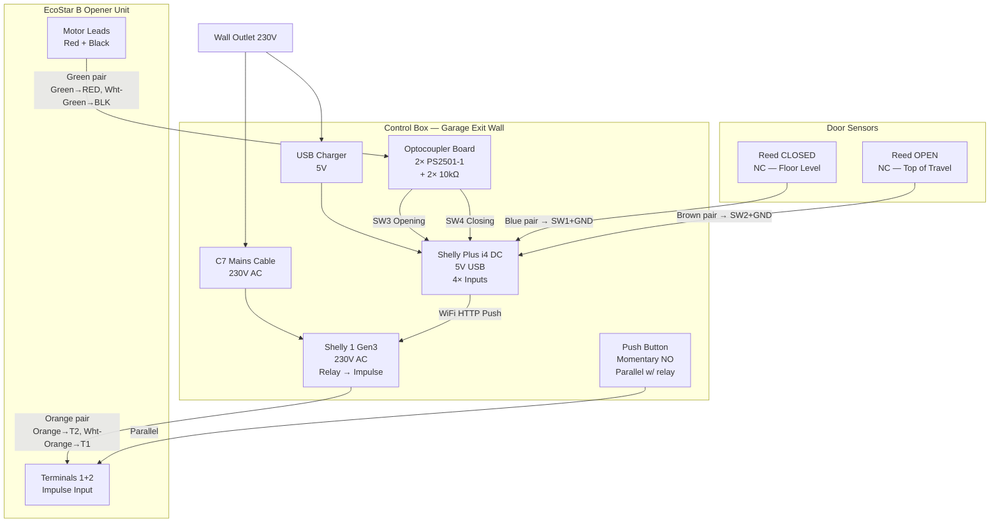
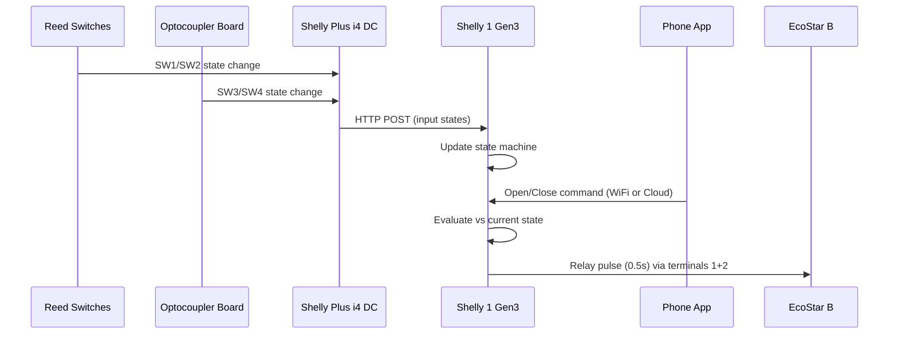
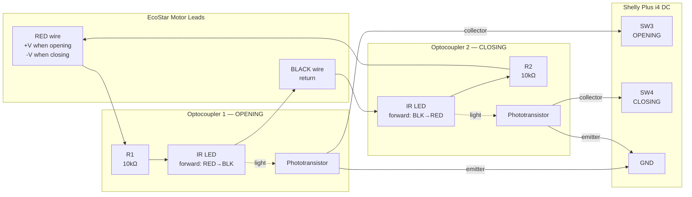
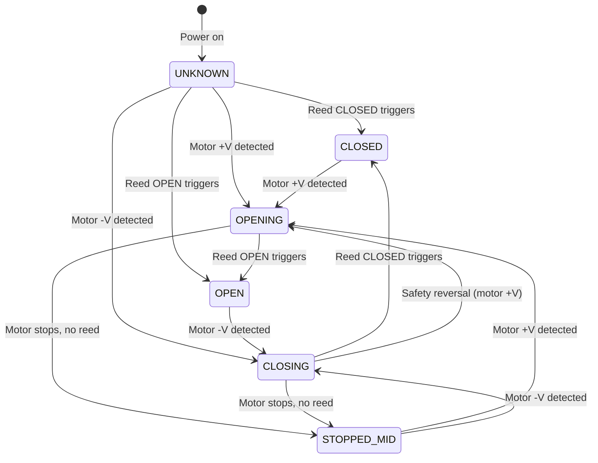
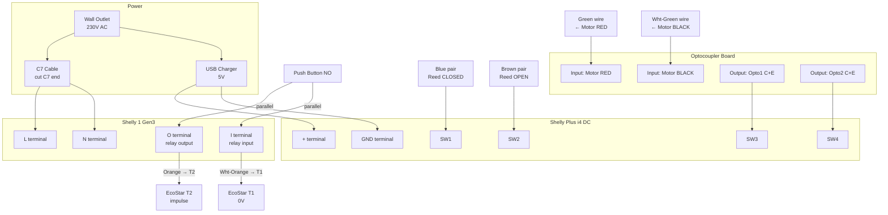
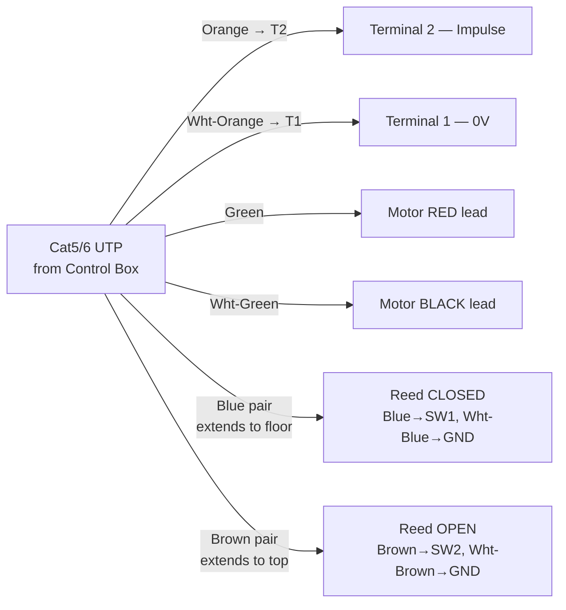

# EcoStar B Garage Door Automation — Hardware Specification & Design

> **Initial-research snapshot.** The **wiring / BOM / terminal map / motor measurements here are still
> authoritative** and match the build. The **software / state-machine sections (§4, §7) are early design
> and superseded** — the shipped design derives state on the **i4 monitor** (not the S1) with a **7-state**
> model (`STOPPED_OPENING`/`STOPPED_CLOSING`, not a single `STOPPED_MID`). See
> [docs/spec/02-state-machine.md](../spec/02-state-machine.md) and
> [docs/spec/01-architecture.md](../spec/01-architecture.md) for the current design.

## 1. Overview

Smart automation of a Hörmann EcoStar B garage door operator (circa 2006) using two Shelly devices for control and state detection, with full galvanic isolation from the opener's electronics.

### Goals

- Remote open/close via phone app (local WiFi and optionally internet)
- Full door state tracking: CLOSED, OPEN, OPENING, CLOSING, STOPPED_MID, UNKNOWN
- Physical wall button for manual operation independent of WiFi
- RF remotes continue to work independently
- No dependency on cloud services for core operation
- Visual confirmation before remote close (camera/detection — TBD)

### High-Level Architecture



### Communication Model



- **i4 DC → Shelly 1 Gen3**: Local HTTP API calls over WiFi (push on state change)
- **Shelly 1 Gen3**: Holds current door state in RAM, makes command decisions locally
- **Phone App → Shelly 1 Gen3**: Shelly Cloud (local WiFi, optional internet via Shelly Cloud)
- **Optional**: MQTT to local or remote broker for integration with other systems

WiFi down = physical button and RF remotes still operate the door. Smart control and state tracking unavailable until WiFi restores.

---

## 2. Garage Door Operator — EcoStar B

### Unit Identification

| Field | Value |
|-------|-------|
| Model | Hörmann EcoStar B (original, not Liftronic 500) |
| Document | TR10C001 RE, 05.2004 |
| Serial | 45319994209 B |
| Motor | Valeo 404.854-3, 24VDC, 54W |
| Manufactured | ~2006 |
| Mains | 230/240V AC, 50/60Hz |
| Push/Pull Force | 500N (650N peak) |
| Door Speed | ~13.5 cm/s |
| Radio | 433.92 MHz rolling code, 6 buttons (FIFO) |

### Terminal Map

| Terminal | Function | Factory State |
|----------|----------|---------------|
| **1** | 0V (ground) | — |
| **2** | Impulse input | — |
| **3** | +24V DC output (max 100mA total) | Measured: 25.93V |
| **4** | STOP / emergency-OFF input | Jumpered to 5 |
| **5** | 0V | Jumpered to 4 |
| **6** | Safety device input (SE) | 8.2kΩ to 7 |
| **7** | 0V | 8.2kΩ to 6 |

Terminals 8–12 are **unpopulated** on this board revision. No onboard free-wired relay output. No DIL switches.

### Motor Voltage Measurements

Measured at motor leads (red/black wires at PCB connector):

| State | Voltage (red vs black) |
|-------|----------------------|
| Stopped | 0V |
| Opening | +19V to +24V |
| Closing | -19V to -24V |

The motor is driven by an H-bridge using 3× NAIS JS1-24V-F relays. Polarity reversal provides direction information.

### Impulse Sequence (Normal Operation)

The operator works on a deterministic impulse cycle:

```mermaid
stateDiagram-v2
    [*] --> Moving_A: 1st impulse
    Moving_A --> Stopped_1: 2nd impulse
    Stopped_1 --> Moving_B: 3rd impulse
    Moving_B --> Stopped_2: 4th impulse
    Stopped_2 --> Moving_A: 5th impulse

    state Moving_A {
        direction LR
        note right of Moving_A: Toward end-of-travel
    }
    state Moving_B {
        direction LR
        note right of Moving_B: Opposite direction
    }
```

After power failure during travel, first impulse always opens.

### Key Procedures

**Delete door data**: Unplug → hold T → plug in while holding → release when light flashes once.

**Program (teach-in)**: Press T → door opens (reference run) → press T → door closes (teach-in) → door auto-opens → run 3+ full cycles.

**Program remote**: Briefly press P → LED slow flash → press remote button → LED rapid flash → release → press same button again → LED very rapid flash → done.

**Force adjustment**: P1 (open force), P2 (close force). Clockwise = more force. Max 1/8 turn per attempt.

### Manual Reference

Original manual: `eurostar garage openener - Installation, Operating and Maintenance Instructions.pdf` (TR10C001 RE, 05.2004)
Online: https://www.yumpu.com/en/document/view/32460894/ecostar-b-garage-door-operator

---

## 3. Hardware Components

### 3.1 Shelly 1 Gen3 — Relay Controller

**Role**: Triggers the EcoStar impulse input (terminals 1+2). Holds door state in RAM. Receives commands from phone app and state updates from i4 DC.

| Spec | Value |
|------|-------|
| Power | 110–240V AC (mains via C7 cable) |
| Relay | Dry contact (potential-free), 16A/240VAC |
| SW input | 1× (unused in this design) |
| Connectivity | WiFi 802.11 b/g/n, BLE 4.2 |
| Chip | ESP-Shelly-C38F, 8MB flash |
| MQTT | Yes |
| Scripting | mJS |
| Size | 37×42×16mm |
| Power consumption | <1.2W |

**Configuration**:
- Auto-off: 0.5s (momentary pulse)
- Mode: Detached (SW input independent of relay)
- Scripting: State machine logic, HTTP server for i4 DC state push

### 3.2 Shelly Plus i4 DC — State Sensor

**Role**: Reads 4 dry-contact inputs from reed switches and optocoupler motor sensing circuit. Pushes state changes to Shelly 1 Gen3 via local HTTP API.

| Spec | Value |
|------|-------|
| Power | 5–24V DC (5V from USB charger) |
| Inputs | 4× dry contact (SW1–SW4) |
| Connectivity | WiFi 802.11 b/g/n, BLE 4.2 |
| Chip | ESP32 (Plus generation) |
| MQTT | Yes |
| Scripting | mJS |
| Size | 37×42×16mm |
| Power consumption | <1W (~200mA at 5V) |

**Input allocation**:

| Input | Signal | Source | Type |
|-------|--------|--------|------|
| SW1 | Door CLOSED | Reed switch at floor | NC — closed when magnet present |
| SW2 | Door OPEN | Reed switch at top of travel | NC — closed when magnet present |
| SW3 | Motor OPENING | Optocoupler 1 output | Closed when motor drives +V |
| SW4 | Motor CLOSING | Optocoupler 2 output | Closed when motor drives -V |

### 3.3 Motor Direction Sensing Circuit

Two optocouplers wired anti-parallel across the motor leads provide galvanic isolation and direction detection.

#### Schematic

> Detailed circuit diagram available in `motor-sense.svg`



**How it works**:

- Motor OPENING (+19..+24V on red): Current flows RED → R1 → Opto1 LED (forward biased) → BLACK. Opto1 transistor conducts, SW3 closes. Opto2 LED reverse biased, blocks.
- Motor CLOSING (-19..-24V on red): Current flows BLACK → Opto2 LED (forward biased) → R2 → RED. Opto2 transistor conducts, SW4 closes. Opto1 LED reverse biased, blocks.
- Motor STOPPED (0V): Neither optocoupler conducts. SW3 and SW4 both open.

**Component values**: R = 10kΩ gives ~2mA LED current at 20V. Well within PC817/PS2501-1 specs (min useful ~1mA, max 50mA). Low current extends optocoupler lifetime to 50,000+ hours.

**Isolation**: 5kV RMS between input and output sides. Zero electrical connection between EcoStar motor circuit and Shelly i4 DC.

A detailed SVG circuit diagram is available: `motor-sense.svg`

### 3.4 Reed Switches

Two surface-mounted NC (normally closed) magnetic door contacts in metal housing.

- **CLOSED position**: Mounted at floor level on door frame. Magnet on door panel. When door is fully closed, magnet is adjacent to reed switch → circuit closed. Door moves away → circuit opens.
- **OPEN position**: Mounted near top of travel on rail/frame. Same principle.

NC (normally closed) was chosen deliberately: a broken wire or disconnected sensor reads as "door not in position" rather than silently failing. Same fail-safe principle as alarm systems.

### 3.5 Physical Push Button

Momentary NO (normally open) panel-mount push button. Wired in parallel with the Shelly 1 Gen3 relay output, directly across EcoStar terminals 1 (0V) and 2 (impulse input).

Works completely independently of WiFi, Shelly, or any smart home infrastructure. Press = impulse = door acts per its internal sequence.

### 3.6 Power Supply

| Device | Power Source | Method |
|--------|-------------|--------|
| Shelly 1 Gen3 | 230V AC mains | C7 cable, cut off C7 end, wire L+N to Shelly |
| Shelly Plus i4 DC | 5V DC | USB charger plugged into same outlet |
| EcoStar B | 230V AC mains | Existing outlet near opener unit |

The i4 DC is NOT powered from the EcoStar's 24V terminal 3 output. This avoids loading the opener's limited 100mA supply and keeps the systems electrically independent.

### 3.7 Cabling

**Single Cat5/6 UTP cable** (~10–15m) runs from the control box to the opener area. 4 twisted pairs = 8 conductors.

| Pair | Solid Conductor | Striped Conductor | Signal |
|------|----------------|-------------------|--------|
| **Orange** | Orange → EcoStar Terminal 2 (impulse) | White-Orange → EcoStar Terminal 1 (0V) | Impulse relay + button |
| **Green** | Green → Motor RED lead | White-Green → Motor BLACK lead | Motor direction sense → Optocoupler board |
| **Blue** | Blue → i4 DC SW1 | White-Blue → i4 DC GND (SW1 return) | Reed CLOSED at floor |
| **Brown** | Brown → i4 DC SW2 | White-Brown → i4 DC GND (SW2 return) | Reed OPEN at top of travel |

Reed switches require short additional runs from the Cat cable to their mounting positions on the door frame.

### 3.8 Enclosure

All active electronics (both Shellys, USB charger, optocoupler board, push button) mounted in a project box at the garage exit wall, at comfortable arm height. Box mounted near existing mains outlet.

---

## 4. State Machine

### States

| State | Description | Derived From |
|-------|-------------|-------------|
| UNKNOWN | Bootstrap / no data yet | Power-on default |
| CLOSED | Door fully closed | Reed CLOSED active (SW1 closed) |
| OPEN | Door fully open | Reed OPEN active (SW2 closed) |
| OPENING | Motor running, opening direction | SW3 active (opto1 conducting) |
| CLOSING | Motor running, closing direction | SW4 active (opto2 conducting) |
| STOPPED_MID | Motor stopped between end positions | No motor signal, neither reed active |

### State Transitions



### Rules

1. **Reed switches always win** — they are ground truth for end positions. If reed CLOSED triggers, state is CLOSED regardless of motor tracking.
2. **Direction tracking**: EcoStar impulse sequence is deterministic. Motor starts + last position was CLOSED → OPENING. Motor starts + last position was OPEN → CLOSING. Motor starts + was STOPPED_MID → opposite of last travel direction.
3. **Bootstrap**: Power on → UNKNOWN. Wait for any reed or motor event to resolve. UNKNOWN means "don't assume, wait for a signal."
4. **Safety reversal**: If motor is CLOSING and suddenly SW3 (opening) activates without a stop, the EcoStar has initiated a safety reversal. Reed events will resolve the final position.
5. **Manual release**: If door is moved by hand (cord pull), motor signals are absent. Reeds catch end positions. Mid-travel by hand is invisible — acceptable edge case.

### State Push Model

The i4 DC pushes state to the Shelly 1 Gen3 on every input change via local HTTP API call. The Shelly 1 Gen3 stores three booleans in RAM:

```
doorClosed = true/false    (SW1)
doorOpen   = true/false    (SW2)
motorOpening = true/false  (SW3)
motorClosing = true/false  (SW4)
```

From these, the Shelly 1 derives the current state and makes command decisions:

| doorClosed | doorOpen | motorOpening | motorClosing | **State** |
|---|---|---|---|---|
| true | false | false | false | CLOSED |
| false | true | false | false | OPEN |
| false | false | true | false | OPENING |
| false | false | false | true | CLOSING |
| false | false | false | false | STOPPED_MID |
| — | — | — | — | UNKNOWN (no data yet) |

---

## 5. Bill of Materials

### Proshop.no — Order Placed

| # | Item | Art.nr | Qty | Unit Price | Link |
|---|------|--------|-----|-----------|------|
| 1 | Shelly 1 Gen3 | 3278568 | 1 | 177 kr | [proshop.no](https://www.proshop.no/Smarthus/Shelly-1-Gen3/3278568) |
| 2 | Shelly Plus i4 DC | 3165213 | 1 | 183 kr | [proshop.no](https://www.proshop.no/Smarthus/Shelly-Plus-i4-DC/3165213) |
| 3 | Pro Strømkabel C7 (2-pin) Svart 1.5m Rett | 2474969 | 1 | 69 kr | [proshop.no](https://www.proshop.no/2474969) |

### Electrokit.se — Order Placed

| # | Item | Art.nr | Qty | Unit Price | Link |
|---|------|--------|-----|-----------|------|
| 4 | PS2501-1 DIP-4 optokopplare (PC817 equiv.) | 40300817 | 10 | 1.28 SEK | [electrokit.com](https://www.electrokit.com/en/pc817x-dip-4-optokopplare) |
| 5 | Motstånd kolfilm 0.25W 10kΩ | 40810410 | 10 | 0.80 SEK | [electrokit.com](https://www.electrokit.com/en/motstand-kolfilm-0.25w-10kohm-10k) |
| 6 | Tryckknapp ø16mm 1-pol off-(on) svart | 41013098 | 2 | 19.60 SEK | [electrokit.com](https://www.electrokit.com/en/tryckknapp-15mm-1-pol-off-onsvart) |
| 7 | Nätsladd CEE7/16 vinklad till C7 vinklad 3m svart | 41021784 | 1 | 47.20 SEK | electrokit.com (art.nr 41021784) |
| 8 | Apparatlåda FB26 89×134×43mm med fläns, svart | 12109026 | 1 | 73.60 SEK | [electrokit.com](https://www.electrokit.com/en/apparatlada-fb26-svart-89x134x43mm) |
| 9 | 1-port USB-laddare 5W 1A svart | 41021800 | 1 | 47.20 SEK | [electrokit.com](https://www.electrokit.com/en/usb-a-charger-5-wblack) |
| 10 | Kabelgenomföring ø5.5/8.4mm 3.3mm | 41023924 | 5 | 1.44 SEK | electrokit.com (art.nr 41023924) |

### MrSmart.no — Order Placed

| # | Item | SKU | Qty | Unit Price | Link |
|---|------|-----|-----|-----------|------|
| 11 | Magnetisk dørkontakt sensor NC, metall, reed-bryter + skruer | MR-00326 | 2 | 239 kr | [mrsmart.no](https://mrsmart.no/magnetisk-dorkontakt-sensor-normalt-lukket-reed-bryter-skruer-id326) |

### eBay / Alloremotecontrol — Order Placed

| # | Item | Qty | Price | Link |
|---|------|-----|-------|------|
| 12 | Aftermarket EcoStar remote (clone) | 1 | ~£7 | [eBay](https://ebay.us/m/q75xgi) |
| 13 | ALLOTECH ECO2 remote (RSC2 compatible) | 1 | €16.90 | [alloremotecontrol.com](https://www.alloremotecontrol.com/product/ecostar-rsc2/) |

### Already On Hand

| Item | Notes |
|------|-------|
| Cat5/6 UTP cable ~10–15m | Single run from box to opener area |
| Round perfboard with mounting holes | For optocoupler sensing circuit |
| Soldering iron + solder | Assembly of optocoupler board |
| Multimeter | Motor voltage measurements confirmed |

### Notes

- The Electrokit order includes spares (10× optocouplers, 10× resistors, 2× buttons) — only 2+2+1 needed for this project.
- The Proshop C7 cable (1.5m, straight) is a spare. The Electrokit C7 cable (3m, angled both ends) is the primary for this build.
- The USB charger from Electrokit replaces the "from drawer" plan — dedicated 5V 1A supply for the i4 DC.
- Cable grommets (5×) provide clean cable entry points into the enclosure for mains cable, Cat5, and USB.

---

## 6. Wiring Summary

### Control Box (garage exit wall)



### At EcoStar Opener Unit



---

## 7. Software (High Level)

Detailed software design is TBD. High-level intent:

### Shelly Plus i4 DC Script
- Monitors SW1–SW4 for state changes
- On any change, HTTP POST to Shelly 1 Gen3 with current input states
- Optionally publishes to local/remote MQTT broker

### Shelly 1 Gen3 Script
- HTTP endpoint receives state pushes from i4 DC
- Maintains state machine in RAM (current state + last direction)
- Evaluates commands (open/close/toggle) against current state before actuating relay
- Exposes state via Shelly Cloud for phone app
- Optionally publishes state to local/remote MQTT broker

### Phone App
- Shelly Smart Control app (free, iOS/Android)
- Shows door state (via Shelly Cloud or local)
- Open/Close buttons
- Operates over local WiFi; optionally over internet via Shelly Cloud

### Future / Optional
- Local MQTT broker (e.g., Home Assistant Green) for advanced automation
- Adafruit IO as remote MQTT bridge
- Camera integration for visual confirmation before remote close
- Safety detection (obstruction sensing) — TBD

---

## 8. Photos & Reference Files

| File | Description |
|------|-------------|
| `eurostar garage openener - Installation, Operating and Maintenance Instructions.pdf` | Original manual (TR10C001 RE, 05.2004) |
| `motor-sense.svg` | Optocoupler sensing circuit diagram |
| `pcb-relays.jpg` | PCB close-up: 3× NAIS relays, terminals 1–7 |
| `pcb-underside.jpg` | PCB from below showing motor connection |
| `ecostar-label.jpg` | Unit serial number and specs label |
| `manual-schematic.jpg` | Manual page with terminal schematic (fig 15–19) |
