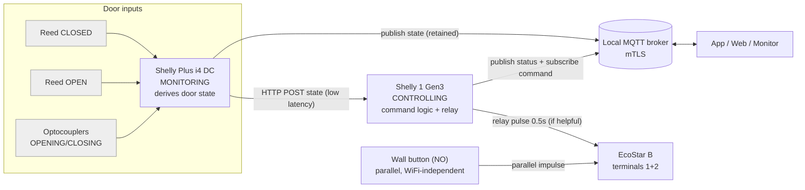

# 01 — Architecture

## Two devices, two roles

This project splits responsibility across the two Shellys. This is the defining decision (D-01).

### Shelly Plus i4 DC — MONITORING unit

- **Owns door-state derivation.** Reads SW1–SW4 (2 reeds + 2 optocoupler motor signals) and computes
  the current door state (see [02-state-machine.md](02-state-machine.md)).
- On **every state change**, it does two things:
  1. **HTTP-direct POST to the controller (S1)** — lowest latency, broker-independent. This is the
     path S1's command logic depends on.
  2. **Publish to MQTT** (`devices/<i4-id>/heartbeat`, retained) so any subscriber — app, web, the
     layer-3 monitor's neighbours — can follow the door.
- Publishes `mon/<i4-id>/alive` (non-retained) for infra liveness.

### Shelly 1 Gen3 — CONTROLLING unit

- Receives open/close/toggle commands from the outside world (MQTT `devices/<s1-id>/command`, local
  HTTP, physical button is separate/parallel).
- Holds the **latest door picture** pushed by the i4 (last state + last direction), in RAM.
- Decides whether to actuate: pulses the EcoStar impulse input (relay, 0.5s) **only when it would help**.
  Crucially it **suppresses counterproductive pulses** — e.g. an "open" command while the door is
  already `OPENING` is dropped, because a pulse mid-travel would *stop* the EcoStar (its impulse
  sequence is move → stop → reverse → stop → …).
- Publishes its own retained heartbeat (relay/command status, config version) + `mon/<s1-id>/alive`.

## Transport rules (carry-forward from NEW-PROJECT-GUIDE)

1. **Core control never depends on the broker.** Physical button + RF remotes always work. The
   i4→S1 HTTP path works on the LAN with the broker/Pi down. MQTT is an overlay for remote clients +
   monitoring, not a dependency of the door working.
2. **i4→S1 is HTTP-direct** for latency and independence; MQTT is *additional*, not the link between
   the two devices. The POST is **fire-and-forget with a short timeout** — if S1 is down/unreachable the
   i4 logs it and carries on (still publishing to MQTT). The i4 must **never block or wedge** on a failed
   POST (D-10).
3. **Why state lives on the i4, not S1** (differs from the original hardware-spec, which put the state
   machine on S1): the i4 is the only device wired to the sensors, so it has first-hand truth and can
   derive + broadcast state without a round-trip. S1 consumes that picture to make command decisions.
   See decision D-02 in [08](08-decisions-and-open-questions.md).

## Failure modes

| Condition | Door still operable? | State tracking? |
|---|---|---|
| Broker / Pi down | Yes (button, RF, local HTTP, i4→S1 HTTP) | Local only; MQTT subscribers stale |
| WiFi down | Yes (button, RF) | No smart control until WiFi returns |
| i4 down | Yes (button, RF, direct command to S1) | No derived state; S1 should treat state as UNKNOWN |
| S1 down / unreachable | Yes (button, RF) | i4 **never blocks** on the failed POST — still publishes state to MQTT and carries on (D-10) |
| Mains power loss | Yes once restored | Boot to safe state; resume only on `reset_reason == 3` |
