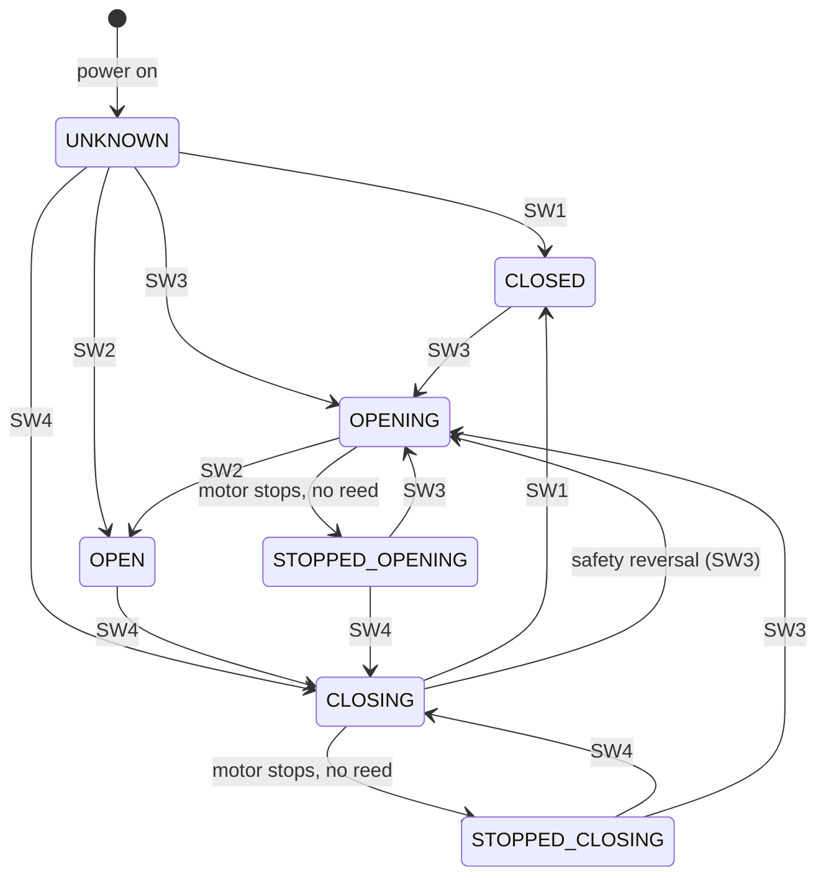

# 02 — Door state machine

Lives on the **i4 (monitoring unit)**. Derived from four dry-contact inputs.

## Inputs

| Input | Signal | Source | Sense |
|---|---|---|---|
| SW1 | Door CLOSED | Reed at floor | NC — closed when magnet present (door shut) |
| SW2 | Door OPEN | Reed at top of travel | NC — closed when magnet present (door open) |
| SW3 | Motor OPENING | Optocoupler 1 | Closed while motor drives +V |
| SW4 | Motor CLOSING | Optocoupler 2 | Closed while motor drives −V |

NC reeds are fail-safe: a broken wire reads "not in position" rather than a false "in position".

## States

| State | Meaning | Primary derivation |
|---|---|---|
| `CLOSED` | Fully closed | SW1 active |
| `OPEN` | Fully open | SW2 active |
| `OPENING` | Moving toward open | SW3 active |
| `CLOSING` | Moving toward closed | SW4 active |
| `STOPPED_OPENING` | Stopped mid-travel, last motion was opening | no motor signal, no reed, last dir = open |
| `STOPPED_CLOSING` | Stopped mid-travel, last motion was closing | no motor signal, no reed, last dir = close |
| `UNKNOWN` | Bootstrap / no data yet | power-on default |

> Note: this refines the original hardware-spec's single `STOPPED_MID` into two states
> (`STOPPED_OPENING` / `STOPPED_CLOSING`), per the user's role description, so the controller can
> decide the *next* useful pulse. The split needs the i4 to remember the last travel direction.

## Rules

1. **Reeds win.** SW1/SW2 are ground truth for end positions, regardless of motor tracking.
2. **Direction from motor sense.** SW3 ⇒ opening, SW4 ⇒ closing. When the motor stops mid-travel,
   the state becomes `STOPPED_OPENING`/`STOPPED_CLOSING` based on the last active direction.
3. **Bootstrap = UNKNOWN.** Wait for any reed or motor event before asserting a state.
4. **Safety reversal.** If `CLOSING` and SW3 (opening) activates without a stop, the EcoStar has
   reversed; reeds resolve the final position.
5. **Manual (cord-pull) moves** produce no motor signal; reeds still catch end positions. Mid-travel
   by hand is invisible — accepted edge case.

## Transitions

## Controller use of state (on S1)

The EcoStar impulse is a single deterministic cycle (move → stop → reverse → stop → …). A pulse at the
wrong moment stops the door. So S1 maps a command + current door state to "pulse or not":

| Command | Door state | Action |
|---|---|---|
| open | CLOSED, STOPPED_CLOSING | pulse |
| open | OPENING, OPEN | **suppress** (already going / there) |
| open | CLOSING | pulse? → needs care: a pulse stops it, not reverse. See open question Q-03. |
| close | OPEN, STOPPED_OPENING | pulse (gated on close-confirmation policy, spec 08) |
| close | CLOSING, CLOSED | **suppress** |

The CLOSING-then-open and edge "stop then reverse needs two pulses" cases are flagged as open
questions in [08-decisions-and-open-questions.md](08-decisions-and-open-questions.md) (Q-03) — to be
nailed down on the bench, since they depend on the EcoStar's exact impulse semantics.
