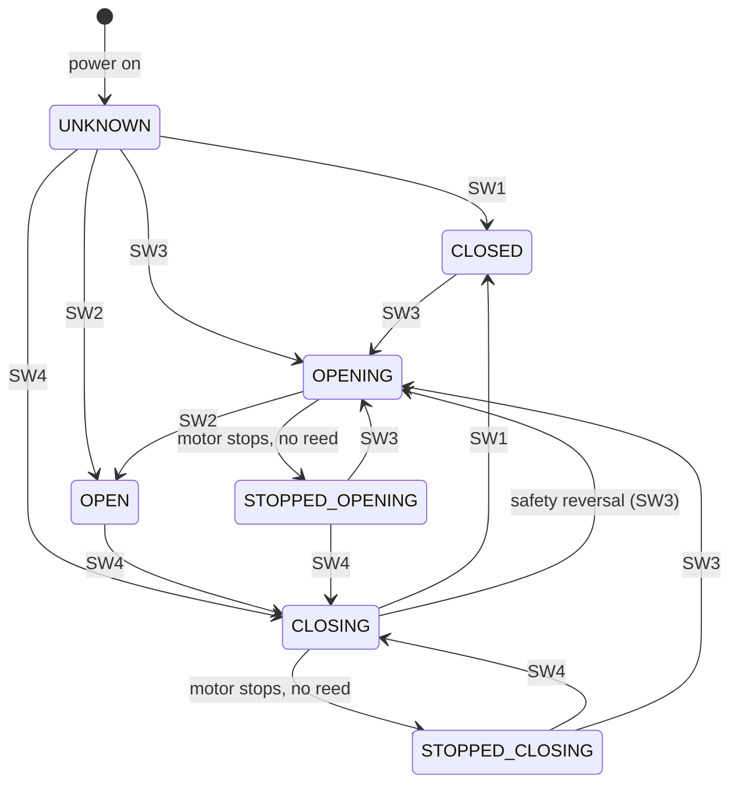

# 02 — Door state machine

Lives on the **i4 (monitoring unit)**. Derived from four dry-contact inputs.

## Inputs

| Input | Signal | Source | Sense |
|---|---|---|---|
| SW1 | Door CLOSED | Reed at floor | NC — closed when magnet present (door shut) |
| SW2 | Door OPEN | Reed at top of travel | NC — closed when magnet present (door open) |
| SW3 | Motor OPENING | Optocoupler 1 | Closed while motor drives +V |
| SW4 | Motor CLOSING | Optocoupler 2 | Closed while motor drives −V |

NC reeds are fail-safe: a broken wire reads "not in position" rather than a false "in position".

## States

| State | Meaning | Primary derivation |
|---|---|---|
| `CLOSED` | Fully closed | SW1 active |
| `OPEN` | Fully open | SW2 active |
| `OPENING` | Moving toward open | SW3 active |
| `CLOSING` | Moving toward closed | SW4 active |
| `STOPPED_OPENING` | Stopped mid-travel, last motion was opening | no motor signal, no reed, last dir = open |
| `STOPPED_CLOSING` | Stopped mid-travel, last motion was closing | no motor signal, no reed, last dir = close |
| `UNKNOWN` | Bootstrap / no data yet | power-on default |

> Note: this refines the original hardware-spec's single `STOPPED_MID` into two states
> (`STOPPED_OPENING` / `STOPPED_CLOSING`), per the user's role description, so the controller can
> decide the *next* useful pulse. The split needs the i4 to remember the last travel direction.

## Rules

1. **Reeds win.** SW1/SW2 are ground truth for end positions, regardless of motor tracking.
2. **Direction from motor sense.** SW3 ⇒ opening, SW4 ⇒ closing. When the motor stops mid-travel,
   the state becomes `STOPPED_OPENING`/`STOPPED_CLOSING` based on the last active direction.
3. **Bootstrap = UNKNOWN.** Wait for any reed or motor event before asserting a state.
4. **Safety reversal.** If `CLOSING` and SW3 (opening) activates without a stop, the EcoStar has
   reversed; reeds resolve the final position.
5. **Manual (cord-pull) moves** produce no motor signal; reeds still catch end positions. Mid-travel
   by hand is invisible — accepted edge case.

## Signal overlap & transients (nuance)

Inputs are **not** mutually exclusive instantaneously — expect transient windows where two signals are
active at once:

- **Reed-then-motor-coast:** as the door reaches an end position the reed (SW1/SW2) triggers, but the
  EcoStar may drive the motor a little longer before disengaging — so SW4 (CLOSING) can still be active
  for a short window *after* SW1 (CLOSED) goes active. Symmetrically for SW2/SW3 at the open end.
- **Motor spin-down / contact bounce:** SW3/SW4 may flicker briefly as the H-bridge relays release,
  and reed contacts can bounce.

**This does not change the states** — Rule 1 (reeds win) already resolves the meaningful overlap: the
moment SW1 is active the door **is** `CLOSED` regardless of a lingering SW4, and likewise SW2 ⇒ `OPEN`
over a lingering SW3. The point is an **implementation** one, called out so the i4 script handles it
deliberately rather than glitching through a spurious state:

- Evaluate state from the **full input snapshot** with reed precedence, not from "whichever edge fired
  last" — otherwise a CLOSED→(SW4 still on) read could momentarily emit `CLOSING` right after arrival.
- **Debounce** reed and optocoupler edges (short settle, e.g. tens of ms — tune on the Pico rig), and
  prefer a brief settle before publishing a state change, so coast/bounce doesn't produce a flurry of
  MQTT/HTTP updates.
- The Pico rig (Phase 2) should **replay these overlaps on purpose** (reed asserts while motor signal is
  still on; motor flicker on release) as test cases.

(Tracked as a Phase-2 implementation detail; see Q-02 in [08-decisions-and-open-questions.md](08-decisions-and-open-questions.md).)

## Transitions



## Controller use of state (on S1)

### Impulse model (confirmed — D-09)

The EcoStar has no "open"/"close" notion. Each impulse just advances a fixed cycle:

```
… MOVING(dir) ──[pulse]──► STOPPED ──[pulse]──► MOVING(opposite dir) ──[pulse]──► STOPPED …
```

- **One pulse to a moving door = STOP** it ("stop what you're doing").
- **One pulse to a stopped door = START in the *opposite* direction to its last movement** ("reverse").
- The unit **alternates direction on each start**, so reversing a moving door takes **two pulses**
  (stop, then reverse) with a **deliberate delay between them** — the unit must register them as
  distinct presses. Tune the delay on the bench (Phase 1.3).

So S1 maps `command + current door state` to a pulse sequence:

| Command | Door state | Pulse sequence | Result |
|---|---|---|---|
| open | CLOSED | 1 pulse | OPENING |
| open | STOPPED_CLOSING | 1 pulse | OPENING (reverse of last move) |
| open | CLOSING | pulse · **delay** · pulse | stop → OPENING |
| open | OPENING, OPEN | none — **suppress** | already going / there |
| open | STOPPED_OPENING | **bench-TBD** | next start reverses to CLOSING; "resume opening" isn't a single pulse — see note |
| close | OPEN | 1 pulse | CLOSING |
| close | STOPPED_OPENING | 1 pulse | CLOSING (reverse of last move) |
| close | OPENING | pulse · **delay** · pulse | stop → CLOSING |
| close | CLOSING, CLOSED | none — **suppress** | already going / there |
| close | STOPPED_CLOSING | **bench-TBD** | next start reverses to OPENING; "resume closing" isn't a single pulse — see note |

### Multi-pulse execution

For the two-pulse cases, the robust pattern is **closed-loop**: pulse → wait for the i4 to report the
intermediate `STOPPED_*` state → pulse again. Because the i4 may be offline (D-10), S1 also needs a
**timed-delay fallback** (blind second pulse after the bench-tuned delay). Decide the primary path in
Phase 3; both are bounded by the same minimum inter-pulse delay.

### Remaining edge (bench item, Q-03)

The `STOPPED_OPENING` + `open` and `STOPPED_CLOSING` + `close` "resume the same direction" cases are
awkward: the unit's next start always *reverses*, so resuming the same direction isn't a single pulse.
Confirm the exact pulse count/behaviour on hardware before encoding it — most real UX here is "press
again," and the user rarely commands the direction the door was already heading when it stopped.
