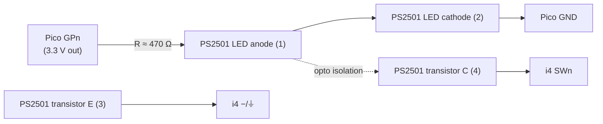
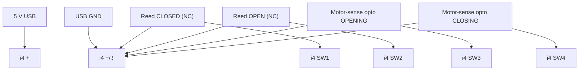

# 12 — Test rig & wiring

How we develop/test/fix the i4 mJS **without touching the real garage**: a Raspberry Pi Pico drives the
i4's four inputs through isolation, we deploy the mJS to the real i4, and we observe the i4's reaction
over RPC and MQTT — all from WSL.

## i4 DC input electrical model (confirmed)

From the official wiring diagram (kb.shelly.cloud) — terminals left→right: **`SW4 SW3 SW2 SW1 ⏚ ⏚ +`**:

- Power: **`+`** = 5–24 V DC supply, **`−`** = supply negative. The two **`⏚`** terminals are extra
  **`−`/common** points (for convenient switch wiring).
- **An input is activated by connecting `SWn` to `−` (ground).** Each switch sits between `SWn` and `−`.
  Released input floats up to `+` internally. So: **contact closed → `SWn` at `−` → input reads true**
  (with `invert:false`). This **matches `hardware-spec.md`** (reeds between SW and GND) — D-16.

> Consequence for the rig: the released input rises toward `+` (up to **5 V** here) — **above the Pico's
> 3.3 V limit**. The rig must be **galvanically isolated** so that voltage never reaches the Pico.
> Optocouplers do this and are exactly what the real motor-sense board already uses.

## Control path (WSL → Windows → Pico)

The Pico's USB is on the **Windows** side; we drive it from WSL via `powershell.exe` → Windows Python →
`mpremote` → `COM5`. The Pico runs **MicroPython v1.28.0**; the simulator firmware is
[`device/test-rig/main.py`](../../device/test-rig/main.py).

- **`mpremote` skips `main.py` at boot and soft-resets on each plain connect** → that would wipe pin
  state. We use **`mpremote resume`** (no soft-reset) + a cached `import main`, so GPIO state persists
  across calls. All of this is wrapped in [`scripts/pico.sh`](../../scripts/pico.sh).
- Channel → GPIO → i4 input map:

  | Channel | Pico GPIO | i4 input | Door meaning |
  |---|---|---|---|
  | 1 | GP2 | SW1 | reed CLOSED |
  | 2 | GP3 | SW2 | reed OPEN |
  | 3 | GP4 | SW3 | motor OPENING |
  | 4 | GP5 | SW4 | motor CLOSING |

  `GPIO HIGH = channel asserted` (contact closed → i4 input pulled to `−` → reads true).

## Interface circuit — one optocoupler per channel (×4)

Uses the on-hand **PS2501** optos (BOM has 10). Galvanically isolated; the Pico and i4 share **no**
ground. Repeat for channels 1–4 (GP2→SW1, GP3→SW2, GP4→SW3, GP5→SW4).

- **Pico side:** `GPn → R → LED(1)`, `LED(2) → Pico GND`. With 3.3 V and ~470 Ω, LED current ≈ 4–5 mA
  (well within PS2501).
- **i4 side:** transistor `C(4) → SWn`, `E(3) → i4 −`. Asserting `GPn` lights the LED → transistor
  conducts → `SWn` pulled to `−` → input active. Releasing `GPn` opens it → input floats to `+` →
  inactive. The 5 V never reaches the Pico.
- **Parts note:** the BOM's resistors are **10 kΩ** (sized for the 20 V motor-sense side). At 3.3 V that
  gives only ~0.2 mA — too weak. **Source 4× ~330–470 Ω** for the rig. *(Alternative: a 4-channel relay
  module with each NO contact across `SWn↔−` — simplest, also isolated, but mechanical/slow; fine for
  reeds, marginal for fast motor transients given our debounce.)*

## Real i4 wiring (target install — for reference)

Same i4-side pattern; the rig's optos stand in for the reeds + motor-sense optos.

Motor-sense opto LED side (across the motor leads, via 10 kΩ) is per `hardware-spec.md §3.3` — unchanged.

## The closed test loop (no human in the loop)

1. **Deploy** the mJS to the i4 over RPC (chunked `Script.PutCode`) from WSL.
2. **Drive** inputs: `scripts/pico.sh closing` / `set 3 1` / `pulse 4 150` …
3. **Observe** the i4's reaction:
   - raw inputs + derived state: `scripts/i4-watch.sh` (RPC `Input.GetStatus`) and the script's own
     HTTP/RPC status;
   - **MQTT**: the i4 publishes door state to `devices/garage-monitor/heartbeat` + `mon/.../alive`
     (spec 03) — subscribing to those is the end-to-end verification the user pointed at. *(Needs a
     separate tooling MQTT identity — don't reuse `garage-monitor`; order from the broker maintainers.)*
4. **Assert** expected vs observed; iterate on the script.

Before the mJS exists, the same path bring-ups the **hardware**: `pico.sh closing` should make
`i4-watch.sh` show `SW4=1`, proving Pico→opto→i4 end to end.

## Pure-logic tests (complement, no hardware)

The physical rig is the integration test. Fast unit tests of the state-derivation logic run as a Node
`node:test` harness mocking the Shelly runtime (coffee-timer pattern) under `device/test/` — added with
the script in Phase 2.
