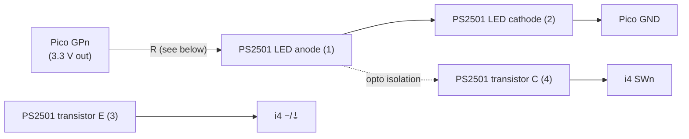
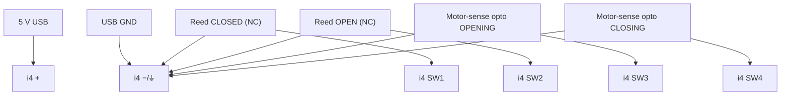

# 12 — Test rig & wiring

How we develop/test/fix the i4 mJS **without touching the real garage**: a Raspberry Pi Pico drives the
i4's four inputs through isolation, we deploy the mJS to the real i4, and we observe the i4's reaction
over RPC and MQTT — all from WSL.

## i4 DC input electrical model (confirmed)

From the official wiring diagram (kb.shelly.cloud) — terminals left→right: **`SW4 SW3 SW2 SW1 ⏚ ⏚ +`**:

- Power: **`+`** = 5–24 V DC supply, **`−`** = supply negative. The two **`⏚`** terminals are extra
  **`−`/common** points (for convenient switch wiring).
- **An input is activated by connecting `SWn` to `−` (ground).** Each switch sits between `SWn` and `−`.
  Released input floats up to `+` internally. So: **contact closed → `SWn` at `−` → input reads true**
  (with `invert:false`). This **matches `hardware-spec.md`** (reeds between SW and GND) — D-16.

> Consequence for the rig: the released input rises toward `+` (up to **5 V** here) — **above the Pico's
> 3.3 V limit**. The rig must be **galvanically isolated** so that voltage never reaches the Pico.
> Optocouplers do this and are exactly what the real motor-sense board already uses.

## Control path (WSL → Windows → Pico)

The Pico's USB is on the **Windows** side; we drive it from WSL via `powershell.exe` → Windows Python →
`mpremote` → `COM5`. The Pico runs **MicroPython v1.28.0**; the simulator firmware is
[`device/test-rig/main.py`](../../device/test-rig/main.py).

- **`mpremote` skips `main.py` at boot and soft-resets on each plain connect** → that would wipe pin
  state. We use **`mpremote resume`** (no soft-reset) + a cached `import main`, so GPIO state persists
  across calls. All of this is wrapped in [`scripts/pico.sh`](../../scripts/pico.sh).
- Channel → GPIO → i4 input map:

  | Channel | Pico GPIO | i4 input | Door meaning |
  |---|---|---|---|
  | 1 | GP2 | SW1 | reed CLOSED |
  | 2 | GP3 | SW2 | reed OPEN |
  | 3 | GP4 | SW3 | motor OPENING |
  | 4 | GP5 | SW4 | motor CLOSING |

  `GPIO HIGH = channel asserted` (contact closed → i4 input pulled to `−` → reads true).

## Interface circuit — one optocoupler per channel (×4)

Uses the on-hand **PS2501** optos (BOM has 10). Galvanically isolated; the Pico and i4 share **no**
ground. Repeat for channels 1–4 (GP2→SW1, GP3→SW2, GP4→SW3, GP5→SW4).

**Proper schematic:** [test-rig-schematic.svg](test-rig-schematic.svg) (one-channel detail + 4-channel
map). Logical view:



**PS2501-1 pinout (DIP-4):** 1 = LED anode, 2 = LED cathode, 3 = transistor emitter, 4 = transistor
collector (pin 1 marked by the dot/bevel).

Per-channel connections — `GPn → R → pin1`; `pin2 → Pico GND`; `pin4 → i4 SWn`; `pin3 → i4 −/⏚`.
Asserting `GPn` lights the LED → transistor conducts → `SWn` pulled to `−` → input active; releasing it
floats `SWn` to `+` → inactive. The 5 V stays on the i4 side.

### Breadboard wiring table

| Ch | Pico GPIO | Pico phys pin | → R → | PS2501 | pin4 (C) → | pin3 (E) → | i4 input |
|----|-----------|---------------|-------|--------|------------|------------|----------|
| 1 | GP2 | 4 | pin1 | #1 | i4 SW1 | i4 −/⏚ | closed reed |
| 2 | GP3 | 5 | pin1 | #2 | i4 SW2 | i4 −/⏚ | open reed |
| 3 | GP4 | 6 | pin1 | #3 | i4 SW3 | i4 −/⏚ | opening |
| 4 | GP5 | 7 | pin1 | #4 | i4 SW4 | i4 −/⏚ | closing |

Common to all: each `pin2 (cathode) → Pico GND` (phys pin 3 or 8); each `pin3 (emitter) → an i4 ⏚`
terminal (the two ⏚ are both `−`). **Do not** connect Pico GND to i4 `−` (that's the isolation).

### Resistor value — what to use with the on-hand parts (3× 330 Ω + many 10 kΩ)

**CONFIRMED on hardware (2026-06-07): use 10 kΩ on all 4 channels.** The i4 input is high-impedance, so
the ~0.2 mA from a 10 kΩ LED resistor is plenty. Bench test on SW1: Pico ch1 asserted → `SW1 = true` →
script derived `CLOSED`; released → `false`; **3/3 assert/release cycles clean**, no marginal behaviour.
The 3× 330 Ω stay as spares. *(If a future opto ever proves weak, 330 Ω ≈ 6 mA is the comfortable
fallback.)*

*(Alternative rig: a 4-channel relay module, each NO contact across `SWn↔−` — zero resistor math, also
isolated, but mechanical/slow; fine for reeds, marginal for fast motor transients given our debounce.)*

## Real i4 wiring (target install — for reference)

Same i4-side pattern; the rig's optos stand in for the reeds + motor-sense optos.



Motor-sense opto LED side (across the motor leads, via 10 kΩ) is per `hardware-spec.md §3.3` — unchanged.

## Optocoupler reuse: 2 permanent + 2 test-only

The final install uses **only 2 optos** (SW3/SW4 motor-sense); SW1/SW2 are mechanical reed switches.
So the rig splits into a permanent pair and a throwaway pair:

| Channel | Rig element | Permanent? | LED driven by (test → final) |
|---------|-------------|------------|------------------------------|
| SW3 (GP4) | PS2501 #3 — **motor-sense** | **Yes** (solder to perfboard) | Pico GP4 → 10 kΩ → LED → Pico GND  →  **motor leads (anti-parallel, 10 kΩ)** |
| SW4 (GP5) | PS2501 #4 — **motor-sense** | **Yes** (solder to perfboard) | Pico GP5 → 10 kΩ → LED → Pico GND  →  **motor leads (anti-parallel, 10 kΩ)** |
| SW1 (GP2) | PS2501 #1 — **reed sim** | No (breadboard, test-only) | Pico GP2 → 10 kΩ → LED → Pico GND  →  **removed; real reed wires SW1↔⏚** |
| SW2 (GP3) | PS2501 #2 — **reed sim** | No (breadboard, test-only) | Pico GP3 → 10 kΩ → LED → Pico GND  →  **removed; real reed wires SW2↔⏚** |

Key point: for the 2 permanent optos, only the **LED (input) side** is rewired at final install
(Pico → motor leads). The **transistor side to the i4 (`collector→SWn`, `emitter→⏚`) never changes** —
the soldered board you bench-test *is* the final motor-sense board. The 2 reed-sim optos come out and
the real reed switches take over. (D-18.)

## The closed test loop (no human in the loop)

1. **Deploy** the mJS to the i4 over RPC (chunked `Script.PutCode`) from WSL.
2. **Drive** inputs: `scripts/pico.sh closing` / `set 3 1` / `pulse 4 150` …
3. **Observe** the i4's reaction:
   - raw inputs + derived state: `scripts/i4-watch.sh` (RPC `Input.GetStatus`) and the script's own
     HTTP/RPC status;
   - **MQTT**: the i4 publishes door state to `devices/garage-monitor/heartbeat` + `mon/.../alive`
     (spec 03) — subscribing to those is the end-to-end verification the user pointed at. *(Needs a
     separate tooling MQTT identity — don't reuse `garage-monitor`; order from the broker maintainers.)*
4. **Assert** expected vs observed; iterate on the script.

Before the mJS exists, the same path bring-ups the **hardware**: `pico.sh closing` should make
`i4-watch.sh` show `SW4=1`, proving Pico→opto→i4 end to end.

## Timed scenario testing (the Pico's "superpower" — verifying TIME-SENSITIVE logic on hardware)

Some i4 logic is **timing-dependent** and cannot be judged from a settled snapshot — it depends on *how
long* a condition holds. The prime example is the **Q-16 motor-direction gate** (spec 14): a reed engaged
while the motor drives away from it means *departure* if sustained (~510–780 ms, measured) but is the
harmless *end-of-travel reverse kick* if brief (~140–220 ms, measured). The script tells them apart by
duration (`GATE_TICKS`, ~400 ms). Debounce and the watchdog thresholds are similarly time-based.

**Why the Pico is the right tool:** the host→Pico link (powershell → mpremote, seconds of latency) cannot
produce precise sub-second input sequences. **MicroPython on the Pico can** — so we put the timing
*on-device*: timed sequence functions in [`device/test-rig/main.py`](../../device/test-rig/main.py) drive
the inputs with `time.sleep_ms()` between steps, replaying the **real-door timings measured at the garage**
(spec 15 / HW-VALIDATION). The host just kicks off the sequence; the Pico runs it to the millisecond.

### WHAT we test this way
- **Reverse-kick absorption** — a brief opposite-motor blip at an end must NOT flip the derived state.
- **Departure detection** — a sustained opposite-motor (reed still engaged) MUST flip to the moving state.
- **Negative control** — a kick *longer* than the gate MUST flip (proves the gate discriminates by
  duration, not blanket-suppresses). Always include one, or the test proves nothing.
- (Same approach fits debounce edges and any future timing parameter.)

### HOW TO run one
Scenarios live in `device/test-rig/main.py` as `_seq([(channels, dwell_ms), …])`. Current set:
`close_arrival(kick_ms, overlap_ms)`, `open_arrival(…)`, `depart_closed(overlap_ms)`, `depart_open(…)`.

1. **Deploy the scenarios to the Pico** (after editing main.py): `scripts/pico.sh deploy`.
2. **Run + verify in one command:** [`scripts/i4-scenario.sh`](../../scripts/i4-scenario.sh) — it subscribes
   to the i4 **heartbeat**, fires the scenario on the Pico, and prints the **sequence of published states**:
   ```
   scripts/i4-scenario.sh 'close_arrival(180)'   # -> CLOSING CLOSED          (kick absorbed, no OPENING)
   scripts/i4-scenario.sh 'close_arrival(500)'   # -> CLOSING CLOSED OPENING CLOSED   (negative control: glitches)
   scripts/i4-scenario.sh 'depart_closed(650)'   # -> CLOSED OPENING          (departure detected)
   ```
3. **Read the result:** the i4 publishes a heartbeat on *every* state change, so a transient glitch appears
   as an **extra OPENING/CLOSING** between the start and end states. Watching the *stream* (not just the
   end state via `/state`) is what makes a sub-tick glitch visible — a settled-snapshot read would miss it.

This suite is a permanent regression tool: re-run it on hardware whenever the timing logic changes.
Results are logged in `docs/testing/HW-VALIDATION.md` (Q-16 gate entry, 2026-06-10).

## Pure-logic tests (complement, no hardware)

The physical rig is the integration test. Fast unit tests of the state-derivation logic run as a Node
`node:test` harness mocking the Shelly runtime (coffee-timer pattern) under `device/test/`. The Node tests
also replay the timed scenarios in *tick* units (deterministic) — the Pico suite confirms the same on real
hardware with real opto/relay timing.
