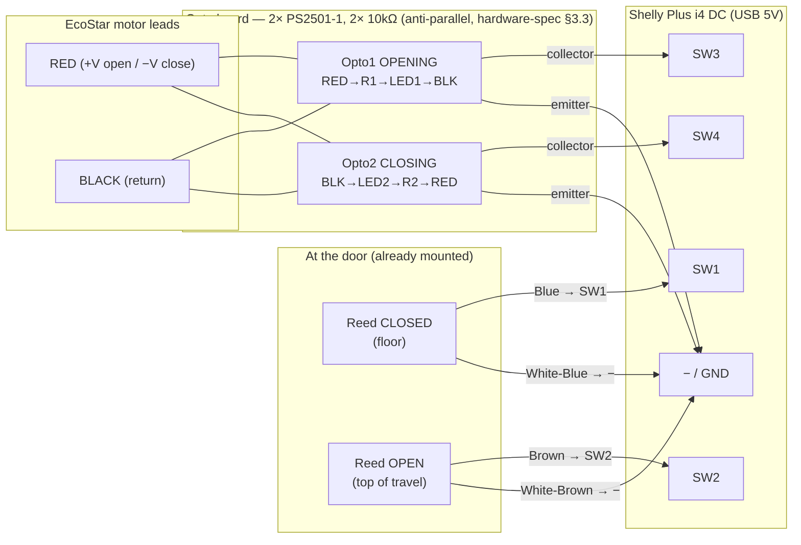

# 15 — In-garage i4 observation session (signal capture for the logic)

> **Purpose:** temporarily wire the **i4 monitor only** to the real door's sensors and **observe** while
> the user drives the door by its existing wall button / RF remote. This captures the *real* timing of
> the reeds and motor-direction optos through actual open/close/stop/reverse cycles — the input data we
> need to nail down the deferred logic (**Q-02** motor-opto behaviour, **Q-03** resume/pulse-gap,
> **Q-16** derive() departure asymmetry + at-rest guard + pulse spacing). See also [02](02-state-machine.md),
> [14](14-motion-timing-and-pulse-safety.md), and the canonical circuit in
> [hardware-spec §3.3–3.7](../initial-research/hardware-spec.md).

## Scope & safety — OBSERVE ONLY

- **i4 only. S1, the orange impulse pair, and EcoStar terminals 1+2 are NOT connected this session.**
  Our side has **no** path to the impulse input, so we **cannot move or stop the door** — zero control
  risk. The **user drives the door** with the existing wall button / RF remote (unchanged, D-04).
- **Galvanic isolation is preserved.** Reeds are passive dry contacts; the motor-direction optos give
  5 kV isolation. The i4 never touches motor or mains voltage. The i4 is **USB-5 V powered**, *not* from
  EcoStar terminal 3 (hardware-spec §3.6).
- The only "live" connection is the **motor-lead tap on the opto LED side** (±19–24 V DC). **Power the
  opener OFF while tapping the motor leads**, then re-energise to drive cycles.

## Wiring (this session)

| i4 input | Signal | From | Connection | Active = |
|---|---|---|---|---|
| **SW1** (id0) | door CLOSED | CLOSED reed (Blue pair) | Blue→SW1, White-Blue→− | magnet present (D-16, `invert:false`) |
| **SW2** (id1) | door OPEN | OPEN reed (Brown pair) | Brown→SW2, White-Brown→− | magnet present |
| **SW3** (id2) | motor OPENING | Opto1 transistor | collector→SW3, emitter→− | motor drives +V |
| **SW4** (id3) | motor CLOSING | Opto2 transistor | collector→SW4, emitter→− | motor drives −V |
| **power** | — | USB 5 V charger | +5V/− | — (not EcoStar term 3) |
| motor tap | direction sense | Green pair | Green→motor RED, White-Green→motor BLACK | LED side only (isolated) |

**NOT connected:** orange pair / EcoStar terminals 1+2 / S1 / S1 mains. The independent push button may
stay as-is (it doesn't involve the i4).

## Pre-drive checks (opener idle, door closed)

Run `IP=192.0.2.160 scripts/i4-watch.sh` and confirm the **rest** reading:
- Door closed → `SW1=1`, `SW2=0`, `SW3=0`, `SW4=0`.
- No flicker on SW3/SW4 at rest (no false motor sense). `/script/1/state` → `CLOSED`.

## Capture protocol

I run, for the whole session, a fast timestamped raw-input log plus periodic derived state:
- `IP=192.0.2.160 INTERVAL=0.1 DURATION=<long> scripts/i4-watch.sh` → ms-stamped SW1..SW4 transitions.
- alongside, poll `curl …/script/1/state` (gives derived `state` + `since`/`ts`) at each cycle.

**User drives these cycles** (tell me before each; I mark timestamps):
1. **Full OPEN** (from closed) — full travel to the top.
2. **Full CLOSE** (from open) — full travel to the floor.
3. **Stop mid-open** — button while opening.
4. **Stop mid-close** — button while closing.
5. **Stop-then-reverse** — button to stop while moving, then button again.
6. **Resume from a stop** — from a mid-travel stop, button again (the Q-03 alternation edge).
7. *(if easy/safe)* **manual cord-pull move** — door moved by hand, no motor signal.

## What each cycle tells us → feeds

- **Motor optos clean + sustained (Q-02):** do SW3/SW4 assert cleanly on real ±24 V, **no chatter**, and
  stay **held for the entire travel** (not a start-only blip)? This is the load-bearing assumption for
  Q-16's `moving = op||cl` detection. Note any onset/offset lead/lag vs the door physically moving.
- **Departure/arrival overlap (Q-16 Problem 1):** measure how long the **closed reed stays engaged after
  SW3 (opening) starts** — that's the real "departing-closed" window (the ~5 cm zone, in ms). Symmetric
  for open reed + SW4. Confirms the motor-direction tiebreaker fix and sizes it.
- **Settle-to-rest (Q-16 Problem 2):** time from motor-off (SW3/SW4 drop) to the door being mechanically
  done — informs `REST_GUARD_MS`.
- **Resume + reverse (Q-03 / D-09):** from STOPPED_*, does the next start go the opposite direction
  (SW3↔SW4 flip)? Latency from button-press to motor-direction signal — informs `PULSE_GAP_MS` and the
  pulse-lockout (Q-16 Problem 3).

## After the session

- Save the raw `i4-watch` log + a per-cycle timing summary into `docs/testing/HW-VALIDATION.md`.
- Feed the measured windows into the Q-16 implementation (spec 14) — these numbers turn the deferred
  fixes from "engineer to best understanding" into measured, tuned values.
- This is **not** the final install (no S1/impulse yet); the full wire-up is the Phase-8 job.
