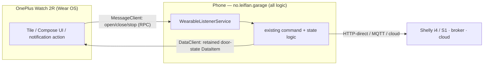

# 17 — Wear OS companion (OnePlus Watch 2R) — exploration

> **Status: EXPLORATION / planning only (2026-06-12). No implementation.** Researched with the
> deep-research harness (18 primary/secondary sources, 24/25 claims verified ≥2/3). Sources listed at the
> end; key claims cite inline. Goal: a watch experience that **leans on the existing phone app**
> (`no.leiflan.garage`, which holds all MQTT/mTLS/HTTP + door state) rather than re-implementing comms on
> the watch, with a **hard no-Google-Play-publish constraint**.

## TL;DR / recommendation

- **The Watch 2R is a real Wear OS device and runs third-party apps** — this is fully doable.
- **Do it in phases** (Google's own recommended progression). Phase 1 needs **zero watch code**.
- **Phase 1 (recommended first / maybe enough):** add **action buttons** (Open / Close / Stop) to a
  **non-ongoing bridged notification** from the phone. Wear OS auto-bridges it to the watch; tapping an
  action fires a `PendingIntent` **on the phone**, which already has all the logic. No Wear module, no
  sideload, no signing headache.
- **Phase 2 (if we want a glanceable control surface):** a small **tethered Wear app** — a **Tile** (and/or
  Compose-for-Wear screen) with Open/Close/Stop + a state glance. The watch only **relays** via the
  Wearable **Data Layer**; the phone does the work. This needs a Wear module, sideloading, and the
  **same-applicationId-and-signing-key** constraint handled.
- **The one real gotcha:** the Data Layer requires the watch and phone apps to share the **same
  `applicationId` AND the same signing key**. Satisfiable with sideloaded debug builds from one machine —
  but it interacts with our debug-vs-CI signing (see §4).

## 1. Platform — OnePlus Watch 2R

- **Genuine Wear OS, supports third-party apps.** OnePlus's spec sheet lists the OS as **"Wear OS 4 +
  RTOS"** and states it *"Supports Wear OS third party apps and third-party watch faces."* So a custom
  companion app can run on it. *(oneplus.com specs; androidcentral)* — verified 3-0.
- **Version is time-sensitive:** shipped on **Wear OS 4**; **Wear OS 5** began a phased rollout ~2025-12-29,
  so a unit in mid-2026 may be on **4 or 5**. Doesn't change third-party-app capability.
- **Dual-chipset / dual-OS:** **Snapdragon W5 Gen 1** (runs full Wear OS) + always-on **BES2700BP** MCU
  (RTOS, background tasks). **Third-party Wear OS apps run on the W5 in normal/"Smart" mode, NOT in
  Power-Saver/RTOS-only mode.** Nuance: choosing a *third-party watch face* disables the dual-engine mode
  (watch runs on W5 alone) — only relevant if we ship a custom face/complication. *(oneplus.com specs +
  press release)* — verified 3-0.
- **No meaningful difference from a Pixel/Galaxy Watch** for app-dev purposes — it's standard Google Wear OS.

## 2. Architecture — leverage the phone, don't re-implement

Google explicitly recommends a **phased** approach, and the **"tethered companion app that depends on the
phone for its core features and data"** is a **first-class, valid endpoint** — not just a stepping stone to
standalone *(Android Developers blog, Aug 2025)*. That maps exactly onto our design: phone keeps
MQTT/mTLS/HTTP + state; watch is a thin relay.

**Data Layer pieces** *(developer.android.com)* — verified 3-0:
- **`MessageClient`** — the recommended mechanism for **RPC-style control**: docs literally say it's *"good
  for remote procedure calls (RPC), such as using a Wear OS device to control the version of your app
  that's installed on a handheld device."* Supports fire-and-forget (`sendMessage`) and request/response
  (`sendRequest`). Use it for **open/close/stop**. Caveat: **best-effort, no retry, needs both nodes
  connected** (`TARGET_NODE_NOT_CONNECTED` if the phone is away) — fine for a phone-present garage relay,
  but it's not a guaranteed-delivery channel.
- **`DataClient` / `DataItem`** — auto-synchronised across devices, **buffered and replayed on reconnect**.
  Use a **small retained DataItem for the latest door state** so the watch's glance survives reconnects
  (unlike best-effort messages). `onDataChanged()` fires on the watch when the phone updates it.
- **`CapabilityClient`** — discover whether the phone app is installed/reachable. **`ChannelClient`** — for
  large/streamed data; not needed here.
- **Android-only:** the Data Layer works only when the watch is paired to an **Android** phone (not iOS).
  Non-issue for us (our app is Android), but it forecloses an iOS pivot for the relay model.

**Minimal watch-side code (Phase 2):** a Tile or one Compose screen + a `MessageClient.sendMessage(...)`
call per button + a `DataClient.OnDataChangedListener` for state. **No networking, no MQTT, no certs on the
watch.** Phone side adds a `WearableListenerService` (receives the command → calls existing send logic) and
publishes door state as a DataItem.

## 3. Watch surfaces — which fit a garage opener

| Surface | One-tap open/close/stop? | State glance? | Watch code | Notes |
|---|---|---|---|---|
| **Bridged notification + action buttons** | ✅ (action buttons) | partial (notification text) | **none** | Auto-bridged from phone; action `PendingIntent` fires **on the phone**. Lowest effort. Used in production by Home Assistant for exactly garage open/close. |
| **Tile** | ✅ (tap → `TileService.onTileRequest`, multi-button via `Clickable` id / `lastClickableId`) | ✅ | small | Best persistent control surface; the tile's service relays via `MessageClient`. |
| **Complication** | ✗ (launch only) | ✅ (tiny) | small | Good for an at-a-glance state dot on the watch face; not for 3 actions. |
| **Compose-for-Wear app screen** | ✅ | ✅ | medium | Full UI; more code than a Tile for the same buttons. |
| **Ongoing Activity** | ✗ | ✅ (while door open) | medium | Watch-side persistent "door is open" chip — note a *phone* ongoing notification does **not** bridge (below), so a watch-side Ongoing Activity is the way to get a persistent glance on the watch. |

**Critical bridging rule** *(developer.android.com/.../notifications/bridger)* — verified 3-0: Wear OS does
**NOT** bridge **ongoing** (`setOngoing`), **local-only** (`setLocalOnly`), or **non-clearable**
(`FLAG_NO_CLEAR`) notifications. **This is exactly why our current design already behaves correctly:**
- our **persistent "Garage open"** status is `setOngoing(true)` + `setLocalOnly(true)` → **stays on the
  phone, never bridges** (matches the user's wish: not on the watch);
- our **two alarms** are non-ongoing + not local-only → **eligible to bridge**.

So a persistent state *glance on the watch* can't come from the phone's ongoing notification — it needs a
watch-side Tile / Complication / Ongoing Activity (Phase 2).

## 4. The signing + applicationId constraint (the key gotcha)

*(developer.android.com/.../data/overview + packaging)* — verified 3-0:

> Google Play services enforces: **the package name must match across devices**, and **the signature of the
> package must match across devices.**

So the watch app must use **the same `applicationId` as the phone app** (`no.leiflan.garage`, **no `.debug`
suffix**) **and be signed with the same key**. Mismatches **silently break** Data Layer pairing (no error,
just nothing arrives).

**How this interacts with our setup:**
- Local `win-build.sh` builds leave the keystore env unset → AGP's **default debug keystore**
  (`~/.android/debug.keystore`), shared across all builds **on one machine**. A watch app built on the same
  machine → same debug key → **matches a locally-built debug phone app**. ✅
- **CI builds** sign with the repo's **`DEBUG_KEYSTORE` secret** keystore (stable signing). A watch app
  would need to be signed with **that same keystore** to pair with a CI-installed phone build.
- **Practical rule:** the phone build currently on the watch-paired phone and the sideloaded watch build
  **must share one keystore**. Easiest: build/sideload **both** from the same machine with the same key
  (and the same `applicationId`, no suffix). This is **reasoned from docs + one dev blog, not yet tested** —
  verify on-device before committing (a mismatched suffix is a known silent failure). *(open question)*

## 5. Sideloading without Google Play

**Supported and is the no-Play path** *(developer.android.com/.../debugging; confirmed on OnePlus Wear
watches by community guides)* — verified 3-0:
1. On the watch: Settings → System → About → tap **Build number 7×** to unlock **Developer options**.
2. Enable **ADB debugging** + **Wireless debugging** (Bluetooth debugging was removed in Wear OS 3 → use
   **Wi-Fi**; watch + computer on the same network).
3. From a computer: **`adb pair`** then **`adb connect <watch-ip>:<port>`**, then `adb install app.apk`.
   "The setup procedure is similar to other Android devices." (USB only on watches with a data-capable port.)

**Can you push the APK from the phone (no computer)?** **Not via a verified first-party path.** The
confirmed route is ADB-over-Wi-Fi from a computer. Community tools (Bugjaeger, Bluetooth APK-transfer apps,
"Wear Installer 2") were *mentioned* in sources but **not independently verified** — flagged as an open
question. Assume **a computer with adb is required** to sideload the watch build.

**Play Store "internal testing" track** is the alternative no-*public*-publish channel, but it **still
uploads to Google**, uses **Play App Signing**, and has tester-account management — heavier than ADB
sideload and arguably against the spirit of the no-Play constraint. **ADB-over-Wi-Fi sideload is the
recommended path.** *(open question: whether internal testing is worth it as a fallback)*

> **Refuted claim (recorded for honesty):** "Wear APKs must use the Multi-APK delivery method." — refuted
> (1-2). The packaging docs don't mandate it for a sideloaded relay app.

## 6. Recommended minimal approach + effort

**Phase 1 — notification actions (do first; possibly enough). ~half a day, phone-only.**
- Add **Open / Close / Stop action buttons** to a **non-ongoing** notification (e.g. the alarm, or a new
  "door open" non-ongoing one), each wrapping a `PendingIntent` → a `BroadcastReceiver` that calls the
  existing controller-command path. Wear OS bridges it; taps execute on the phone.
- **No Wear module, no sideload, no signing constraint.** Gives one-tap control + alerts on the watch today.
- Caveat: notifications are transient glances, not a persistent control surface, and won't show a live
  state dot on the watch face.

**Phase 2 — tethered Wear app (if Phase 1 isn't enough). ~2–4 days + sideload setup.**
- Add a `:wear` Gradle module (Compose for Wear OS), **same `applicationId`, same keystore**.
- A **Tile** with Open/Close/Stop (`Clickable` ids → `lastClickableId`) + door-state text; relays via
  `MessageClient`. Optional **Complication** for an at-a-glance state dot; optional **Ongoing Activity** for
  a persistent "open" chip on the watch.
- Phone side: a `WearableListenerService` to receive commands + publish door state as a retained `DataItem`.
- Distribution: **ADB-over-Wi-Fi sideload** of the debug-signed watch APK (matching the phone's debug key).

**Phase 3 — standalone watch app: not recommended** — it would mean putting MQTT/mTLS/certs on the watch,
exactly what we're avoiding. The tethered model is the intended endpoint here.

## 7. Open questions (carry into any future build)
1. **Phone-only install path?** Is there a verified way to install the watch APK from the phone (Bugjaeger /
   BT transfer / OnePlus app) without a computer, and does the Watch 2R's dev mode allow it?
2. **Signing reality:** if the phone app is a **CI/release** build (its keystore) and the watch app is
   **debug**-signed, does the Data Layer fail to pair? (Likely yes → sideload a matching-key phone build.)
   Verify empirically.
3. **OnePlus background quirks:** any vendor limits on `MessageClient` delivery / dev-mode persistence /
   screen-off behaviour vs. a Pixel/Galaxy Watch that hurt relay reliability?
4. **Internal-testing track** worth it as a fallback vs. pure ADB sideload, given no-public-publish?

## 8. Sources
Primary (Google / OnePlus): Wear data-layer overview, client-types, messages, data-layer; notifications +
bridger + creating; user-interfaces; tiles/interactions; ongoing-activities; packaging; get-started/debugging;
Android Developers blog "Building experiences for Wear OS" (Aug 2025); oneplus.com Watch 2R specs + Watch 2
press release. Secondary/blog (corroboration only): AndroidCentral (does the OnePlus Watch 2 run Wear OS),
HowToGeek sideloading, nek12.dev Wear-in-one-evening (signing pitfalls), Home Assistant companion (garage
actionable notifications). Full URLs in the research output under the task transcript.
